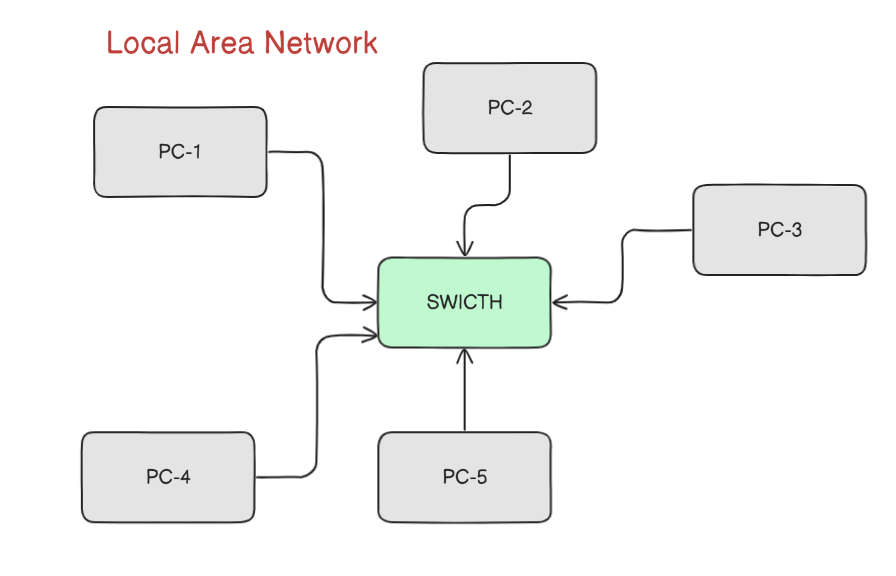
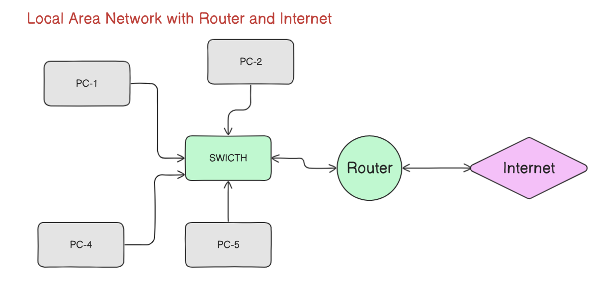
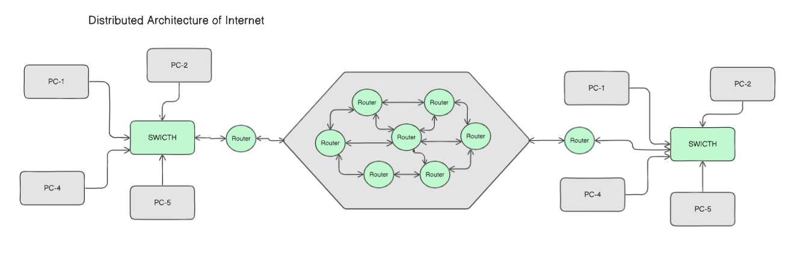
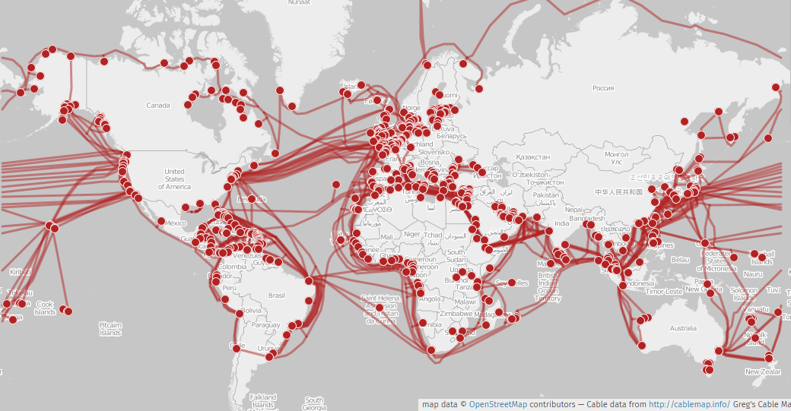
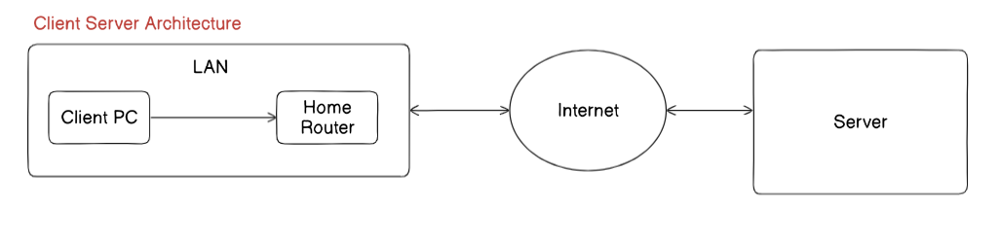
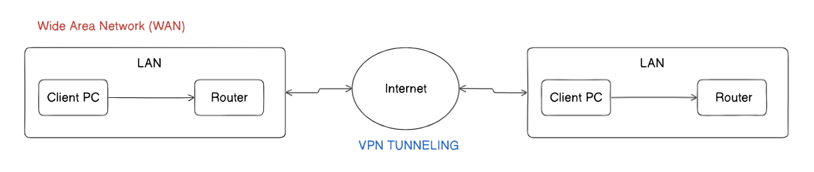

## What is SWITCH and why we need it?
- *Switch* is used to connect multiple computers within a given range, So that they can communicate with each other.
- The various computers are connected to the switch via cables, The cables often used are copper cables (CAT-5, CAT-6) or even optical fibers.
- Here CAT stands for *CATEGORY*
- These interconnection of computers & cables is locally restricted which creates a Network called as *Local Area Network (LAN)*
- Suppose there are 6 computers in the network, PC-1 wants to communicate with PC-5. First the data packet from PC-1 will arrive at switch and then switch decides where to sends the packet. Here PC-5 receives the packet from PC-1.
- *SWITCH* consists of various ports, these are also called as *LAN PORTS*. Every computer has a LAN PORT associated with it, Using CAT-5 cables the Computer and Switch are interconnected with each-other to create a *Local Area Network (LAN)*

## What is Router?
- *Router* is a device which is used to establish a connection between a Computer and the internet.
- The Router and internet is connected via a cable which is provided by the *Internet Service Provider (ISP)*
- Suppose the computer present in a LAN wants to send packets to the internet, This can be achieved using switch and router.
- The computer first sends data packet to the *SWITCH* which then send it to the *ROUTER*, Now the router again sends the packet to the *INTERNET*, Here we can say that computer and internet are connected.

## What does the internet represent?
- Suppose two computers from two different LAN's want's to communicate with each-other its not possible with the *Switch* hence we use *Routers*

- In the diagram we can see that the two LAN's wants to communicate with each-other.
- The internet has multiple routers connected to it. (Distributed Network)
- If there was a single router all over the internet we would face few problems.
	- The length of the cable should be pretty long if want to connect to the LAN
	- Cost ineffective
	- Single point of failure
- To overcome these problems internet uses distributed architecture of routers.

## Inter continent internet connection
- The inter continent connection between multiple continents happen using optical fibers which is laid in the oceans, If any such tragic events occurs may hinder the entire continents internet connection.
- Here optical fiber's are used because of its speed and reliable data transfer.

## How two LAN's communicate with each-other over internet?

- The data packet from LAN-1 first moves to the local switch and then its router.
- The router consists of a processor which internally uses an effective algorithm to generate a routing table. 
- *Routing Tables* are the one's which provides the information about the best way or direction to transfer data from one router to another over clusters of router's (Internet)
- Finally the data packet reaches the destination router, and the user receives the data in their LAN
- This all process is carried out in milliseconds
- The cables connecting various routers is provided by *Internet Service Provider (ISP)* 

## Client - Server architecture

- The client server architecture is the most commonly used architecture for an internet application
- The client first sends the data packet via internet to the server
- The server receives the request and wants to serve it
- The server uses one of the many method of data transfer 
	- Complete Transfer
	- Streaming (Bit by Bit)
- The server can also be in distributed nature which is placed at different corners of the world.

## Wide Area Network (WAN)

- Wide area network (WAN) is the process of communicating or exchanging data packets between two or more LAN's.
- As we already know two or more LAN's can communicate with each-other over internet, But why WAN?
- Communicating via internet there is always an threat of getting hacked. Hence to provide security and safe transfer we use WAN.
- one of the best way to implement WAN is through *Virtual Private Network (VPN)*, VPN uses the technique of *Tunnelling* which safely and securely transfers the data packets.

### Working of WAN
- The data packet from the client-1 is provided to the router-1
- The data packet is first encrypted and encapsulated which is then sent via VPN tunnelling which safely and securely sends the data
- The data packet received at client-2 is first de-capsulated and then decrypted to use the data.

